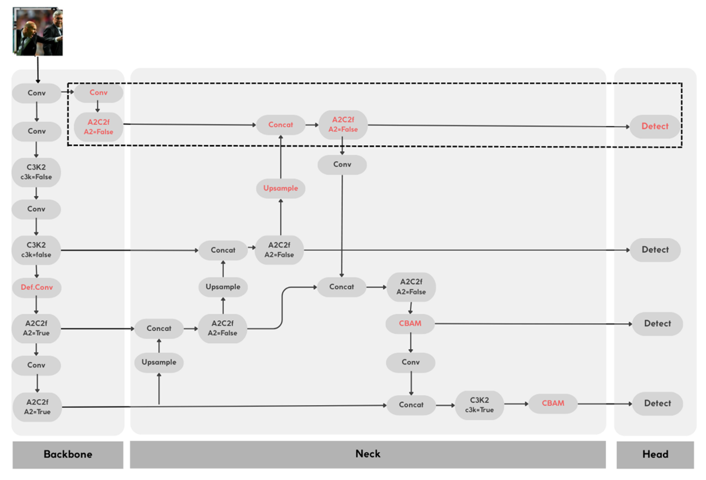

# Architectural Enhancements to YOLOv12 for Thoracic Pathology Detection

##  Abstract
This research introduces a customized deep learning model based on **YOLOv12**, optimized for high-sensitivity detection of thoracic pathologies in chest X-rays. The model balances real-time inference performance with the precision required for medical diagnostics.

> **Publication:** Presented at the **IEEE 21st International Conference on Intelligent Computer Communication and Processing (ICCP 2025)**.

## Proposed Solution & Architectural Enhancements

To address the challenges of medical imaging, I have implemented several key modifications to the standard YOLOv12 architecture. The diagram below illustrates the integration of these components across the Backbone, Neck, and Head.

*Figure 1: Enhanced YOLOv12 architecture featuring P2 High-Resolution branch, CBAM attention blocks, and Deformable Convolutions.*

### Key Enhancements:

* **High-Resolution Detection Branch (P2):** As shown in the top dashed section of the diagram, a dedicated P2 branch was added. This allows the model to process feature maps at a higher resolution, significantly improving the detection of small pulmonary nodules.
* **Convolutional Block Attention Module (CBAM):** Integrated within the Neck (see the red CBAM blocks). This mechanism helps the model focus on the most relevant features by applying both channel and spatial attention.
* **Deformable Convolutions (DCN):** Replaced standard convolutions in the backbone (marked as `Def.Conv` in red). This allows the receptive field to adapt to the irregular shapes of thoracic pathologies like pleural effusion.
* **A2C2f Layers:** Advanced feature aggregation blocks that maintain a high flow of information while reducing computational overhead.
* **Optimized for Medical Use:** Fine-tuned to balance higher sensitivity (recall) with fast inference, crucial for clinical decision support systems.

  ## Experimental Results (Nodule Detection)

Detection of pulmonary nodules is one of the most challenging tasks in medical imaging due to their small size and low contrast. Our modified YOLOv12 architecture significantly outperformed the baseline model:

| Model | mAP@0.5 (Nodule) | mAP@0.5:0.95 (Nodule) | Recall (Nodule) |
| :--- | :---: | :---: | :---: |
| YOLOv12 (Baseline) | 0.0906 | 0.0317 | 0.167 |
| **YOLOv12-Proposed** | **0.1820** | **0.0699** | **0.233** |

### Key Takeaways:
* **Performance Doubled:** The proposed modifications **effectively doubled the mAP@0.5** for nodule detection (from 0.0906 to 0.1820).
* **Superior Recall:** Increased sensitivity means fewer missed pathologies, a critical factor for clinical decision support systems.

##  Targeted Pathologies
The model is trained to identify:
* **Aortic enlargement** | **Cardiomegaly** | **Pleural effusion** | **Pulmonary nodules/masses** 

##  Repository Structure
* `/src`: Core implementation of the P2 branch, CBAM integration, and DCN layers.
* `/paper`: Research paper presented at IEEE ICCP 2025.

---
**Author:** Ruxandra Andro  
**Research Partners:** Cristian-Cosmin Vancea  
**Institution:** Technical University of Cluj-Napoca (UTCN)
